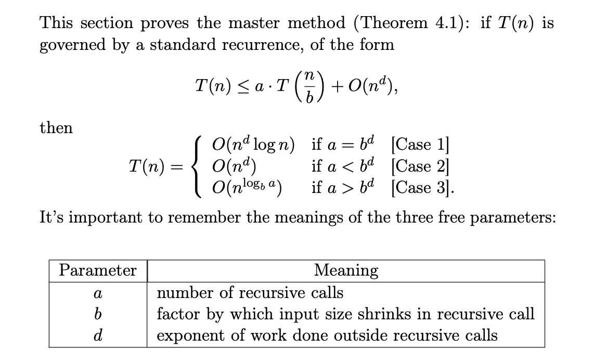
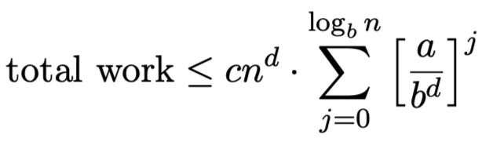
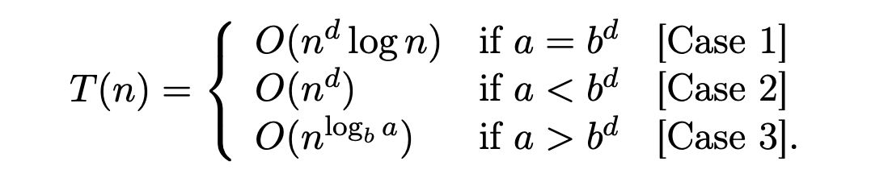
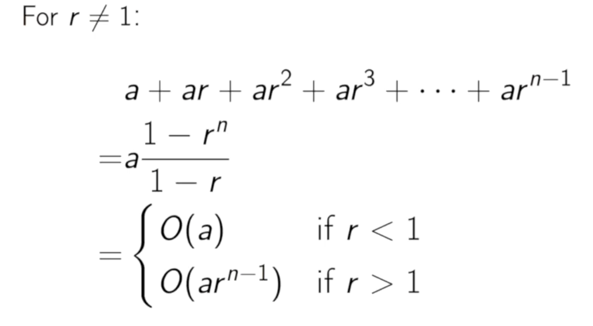

# Master Method

## High Overview

The master method, also known as a master theorem is a way to analyze and define time complexity of algorithms that follow divide and concur algorithmic paradigm and involve recursion. The general formula looks like this, where the $T(n)$ is total work done at that level of the recursion tree.

As you can see the total work done at each level consists of total work done by lower recursive call plus the work done on the level outside from the recursion. For example, in merge sort algorithm such work is comparing to separately sorted arrays to come up with one **merged** array. Another example is in quick sort, where how the array should be **divide** into sub-arrays, so that choosing pivot. In most of the cases, the outside work is either about merging solutions of the subproblems or dividing problem into subproblems. 

The parameters $a,b,d$ are pretty much well-defined. For example, for merge sort the *a* equals to 2, *b* equals to 2 and *d* equals to 1. In order to define Big O notation for a given algorithm using master method we need to use those three parameters and the three cases that are mentioned above. The explanation of the each case is listed below. In sort, we have three cases because the recursion tree’s nodes can have multiple forms and behavior. 

## The actual meaning of the inequality

 

In plain English, this equation mean that the total work done on any given level is less than or equal to the all its child nodes’ total work plus any additional work that has been done on given level that is not part of the recursion. The *a* parameter is responsible for number of child nodes (i.e. number of recursive calls), the *b* parameter is responsible for precisely defining the size of each child node’s work (i.e. factor by which input size shrinks) and *d* parameter is responsible for defining the work done outside of the recursive call (i.e deciding whether that work is constant, linear or polynomial). 

In order to define the total work done by **all** level of recursion tree we simply need to sum up all $T(n)$ results. Which will give us below equation.

## The need for three cases

In order to understand why we need three cases we need what geometrical series are. As you can see below the geometrical series is a sum of all numbers that grow in geometrical progression, that is the power of *r* raises with each new number until *n-1*. The value of *r*  is very important. If *r* is smaller than 1 it means that with every new addition the number gets smaller and smaller, therefore the dominant factor of this series is the first term. If *r* is bigger than 1 it means that with every new addition the number gets bigger and bigger, therefore the dominant factor of this series is the last term. 

 

This concept is closely connected with how the complexity grows (or shrinks) throughout recursion tree. Now, if we look at the “total work” inequality mentioned above we can see a similarity with the equation of the geometric series. $a=cn^d$ and $r=\sum_{j=0}^{\log_b n} \left(\frac{a}{b^d}\right)^j$.
So now depending on the fact whether $\frac{a}{b^d}$ is less than 1 or equal or bigger we can derive our three cases.

For the first case the $a = b^d$, this means that the result of $\frac{a}{b^d}$ is 1, this means that we are doing the same amount work on each level. We know that there are $log_bn$ of layers, thus the time complexity of this case is $O(n^d \log n)$.

For the second case the $a < b^d$, which means that the result of $\frac{a}{b^d}$ is less than 1, this means with each new level of the recursion tree the total work done on each level shrinks, therefore the dominant factor is the root level’s work. Thus the complexity of this case is $O(n^d)$.

For the third case the $a > b^d$, which means that the result of $\frac{a}{b^d}$ is greater than 1, this means with each new level of the recursion tree the total work done on each level grows, therefore the dominant factor is the last level’s work. Thus the complexity of this case is $O\left(n^{\log_b a}\right)$.

This is way we have three cases, because the way how problem size changes on each level may very from algorithm to algorithm but if we know whether $\frac{a}{b^d}$  is greater, smaller or equal to 1, we can determine the time complexity’s shape.
