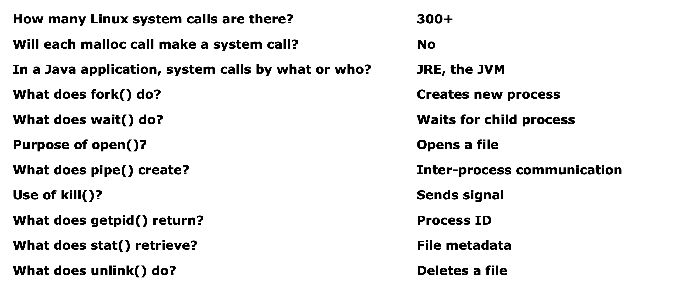
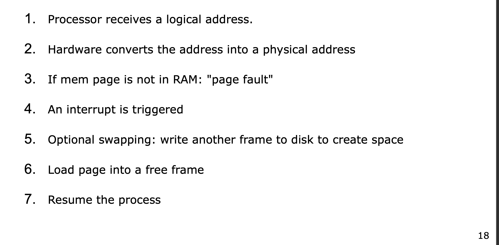
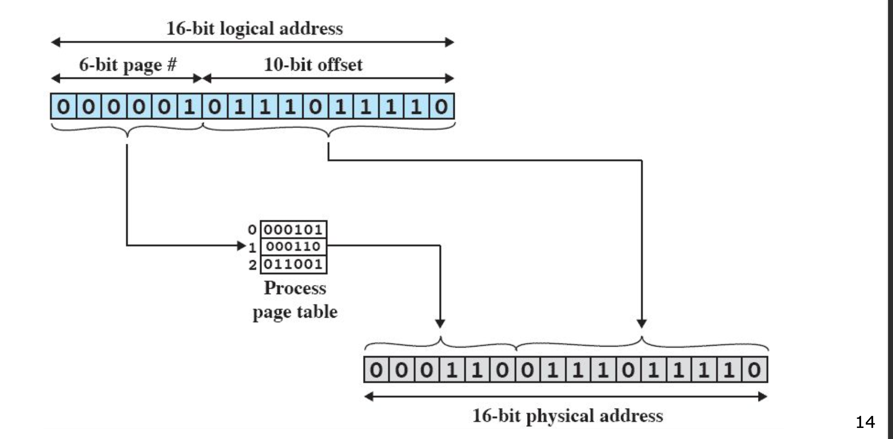

# Infrastructure 3: Computer Systems

## Computer Hardware Architecture

Any computer system starts from the computer hardware. There are two widely used computer hardware architectures: `Von Neumann` and `Harvard` architectures. Each of these architectures has advantages and disadvantages. Note that `Von Neaumann`  architecture is usually used for a personal computers, while `Harvard`  architecture is used in microcontrollers. 

| `Von Neumann` | `Harvard` |
| --- | --- |
| Same physical address **space** is used for both data and instructions. | Separate physical address spaces are used for data and instructions.  |
| There is a common bus for both data and instructions. | Separate buses for data and instructions transferring. |
| Two clock cycles are required to execute single instruction.  | An instruction is executed in a single cycle. |
| It is cheaper in cost.  | It is more costly than Von Neumann. |
| CPU can not access instructions and read/write at the same time. | CPU can access instructions and read/write at the same time. |

  

## Complied, Interpreted and Intermediate Languages

The `compiled` programming languages are the ones, that are being directly converted from source code into machine code. Compilation is being done `ahead-of-time`, which means that the source code is first being compiled into separate file, and only than the latter is being run. Compilation is platform dependent - source code is compiled for specific operating system. Even though there are ways to compile a code for different operating systems as well. 

The `interpreted` programming languages are the ones that are being converted from the source code into machine code directly during the runtime. The source code is being compiled line-by-line during the runtime. Note that some chunks of source code that be compiled into machine code and reused in order to enhance the performance. This process is called `just-in-time` compilation. Each operating system has on top of it an interpreter which on fly interprets the source code into machine code that can be executed on the given operating system. Thus interpreted languages are independent from the operating systems.

The `intermediate` programming languages like Java or Kotlin try to benefit from both approaches and use both interpreter and compiler in order to run the source code. First the code is being compiled using `javac`  into bytecode and only then the bytecode is being interpreted by `JVM`  during runtime. This approach introduces a number of advantages:

- **Portability**: Compile once into bytecode, interprete everywhere using `JVM` . The Java Virtual Machine is specific to the operating system, thus the same bytecode can be interpreted to the machine code using JVM.
- **Security**: As long as the source code isn’t directly complied into machine code, but first compiled into bytecode, the JVM acts as security layer and checks memory safety and prevents other vulnerabilities.
- **Performance**: During bytecode interpretation, JVM can detect frequently used code and convert it into machine code to enhance the performance. Thus JVM can dynamically enhance the performance during the runtime.
- **External Libraries and Frameworks**: JVM can run external libraries and source code during the runtime without needing a full recompilation. The external libraries also take advantage of Java’s portability, thus developers don’t need to worry about writing operating system specific packages.

## System Calls

The `system calls` are low-level APIs provided by the operating system, which are specific to that operating system and CPU architecture. The system calls are used by machine code to execute privileged operations on the computer's hardware. Such operations are process control, file and device manipulations, information maintenance, inter-process communication and protection/security management.

Whenever CPU faces such system call made by the machine code in the user mode, it switches to the kernel mode in order to satisfy the request, after which it switches back to the user mode to continue machine code execution.

Usually every programming language comes with its own set of system-calls-wrapper libraries, which are used for reducing the number of system calls as well as for providing abstract set of APIs, with which developers can interact. As long as system calls trigger CPU to change its mode, they are expensive in terms of performance, thus wrapper libraries not only provide abstracted APIs but also enhance the performance. 

Frequently asked questions’ answers:

## Processes

### Definition

A process is an instance of a program in execution. Process consists of code, data, memory, registers, file descriptors, process id and execution context. 

Multiple processes can be run concurrently. Each process is isolated and has its own virtual memory space. Operating system’s scheduler is responsible for determining when and how long should a process run. The process interact with each other through system calls (e.g. `pipe()`).

<aside>
📌

`fork()` ⇒ A high-level API which internally creates a copy of the current process. A copy is called a child process and the function-triggered process is called parent. Both the parent and child processes continue the program execution from the same point, where the function has been called.

`exec()` ⇒ A high-level API which internally changes the executed program with the given one. The process data, memory, code and other properties are also being changed, except the process id.

</aside>

### Process Scheduling

Process scheduling is being handled by the operating system’s scheduler, which decides which process should be run next, for how long and on which CPU/cores. The operating system is responsible for scheduling the processes in a way that it fits with following principles:

- **Fairness**: Every process gets CPU time fairly
- **Efficiency**: ****Maximize CPU utilization (no idle time)
- **Responsiveness**: ****Keep interactive programs fast and responsive
- **Throughput**: ****Complete as many processes as possible in a time frame
- **Turnaround time**: ****Minimize total time from submission to completion

### Process States

| D | Uninterrupted Sleep ⇒ Usually waiting for low-level I/O. Often happens during blocking system calls.  |
| --- | --- |
| R | Running or Runnable ⇒ The process is either running on the CPU or waiting in the ready queue. |
| S | Interrupted Sleep ⇒ The process is waiting for an event (like keyboard input, disk read, etc.). |
| T | Stopped ⇒ The process has been paused (e.g., by SIGSTOP, CTRL+Z). |
| Z | Zombie ⇒ The process has terminated, but its parent hasn't collected the exit status. |

There are also additional flags that can give insights about the process priority, grouping, etc.

| < | High priority process |
| --- | --- |
| N | Low priority process |
| s | Is a session leader |
| + | In foreground process group (attached to terminal) |
| l | Multi-threaded process |

The processes that have a `R` state are being placed in `ready queue`. Each process has its associated `process context` which is being changed from process-to-process. The `dispatcher` is responsible for context switching. Each process gets from `10-100 ms`  core time. The processes with “higher priority” are being processed first once their state is ready. 

### Preemptive Context Switch

A preemptive context switch occurs when the operating system forcibly stops a running process and switches the CPU to another process, even if the running process hasn't finished or blocked.

During preemptive context switch following events happen:

- Save the current process state (registers, program counter, stack pointer, etc.) in its PCB (Process Control Block).
- Choose the next process to run (based on the scheduling algorithm).
- Load the selected process’s state from its PCB.
- Transfer control to the new process (resume execution).

<aside>
📌

PCB (Process Control Block) contains all the metadata about the process, which is required by the OS while switching the process context or while changing the process state. Each process has its own process control block. The process control block of each process is being stored in kernel space. 

</aside>

## Memory

### Static vs Dynamic Linking

Linking is the process of combining object files (compiled `.o` or `.obj` files) and libraries into a single executable.

`Static`  linking is a process of combining all object files and libraries into one big executable. This creates a single large executable, which has no external dependency, relatively faster but has bigger file size and needs recompilation for updating libraries functionality. 

`Dynamic` linking is a process of creating an executable that references external libraries, that are resolved during runtime. This introduces more flexible approach, where multiple executables can use the same libraries, the executable file is much smaller and no recompilation needed to update the libraries functionality. 

### Logical/Virtual vs Physical Memory Address

The `physical`  memory addresses are the actual unique address that can be found on RAM. The physical addresses are being managed by `MMU`  (Memory Mapping Unit) which is an actual hardware and is a part of the CPU. Physical addresses can only be accessed through kernel mode. 

The `logical/virtual`  memory addresses are being created for each process. As mentioned earlier each process is isolated and has its own memory space. `MMU`  is responsible for mapping the virtual addresses to the physical ones. It uses `memory paging` in order to do so (more about it below).  The user mode only interacts with virtual memory addresses which has a number of advantages:

- **Isolation**: Each process has its own private address space.
- **Security**: One process can’t access another’s memory.
- **Flexibility**: Programs can be loaded anywhere in memory.
- **Paging**: Enables swapping parts of memory to disk (virtual memory).
- **Memory Protection**: Read-only, read-write, execute permissions per page.

<aside>
📌

`Shared memory` is a region of a physical memory that can be accessed by multiple processes. It is one of the ways for providing inter-process communication.

</aside>

### Memory Mapping

First let’s understand some terminology:

- **Frame**: A chunk of physical memory.
- **Page**: A ****chunk of virtual memory that has its corresponding `frame` . It is the virtual view of the actual `frame` .
- **Page Table**: Is a table that maps `pages` to `frames` .
- **Page Fault**: Is a situation when the `page` can not be found in the `page table` from the cache, thus kernel needs to load it from disk.
- **Virtual Memory Address**: An address that consists of `page`  number and `offset` .
- **TLB**: A small, fast cache inside the MMU that stores recently used page table entries. (Translation Lookaside Buffer)
- **MMU**: A hardware component that performs virtual-to-physical address translation at runtime. (Memory Mapping Unit)

The memory mapping is being handled by MMU  and partially by TLB , which is a cache of frequently used pages. The page tables is a data structure stored in the kernel level. The page number from the virtual address is used to find the frame from the page table and then the offset is used to find the physical address within that frame. The page is a virtual representation of the frame. Every process has its own page table which is being handled by kernel. The pages should supposed to be contiguous.

<aside>
📌

Not often used pages can be copied to `swap space` on SSD/HDD storage to make space for new processes.

</aside>

The process of mapping the virtual address to physical one according to lecture slides:

Note: The below is true in case of 6-bit pages.

