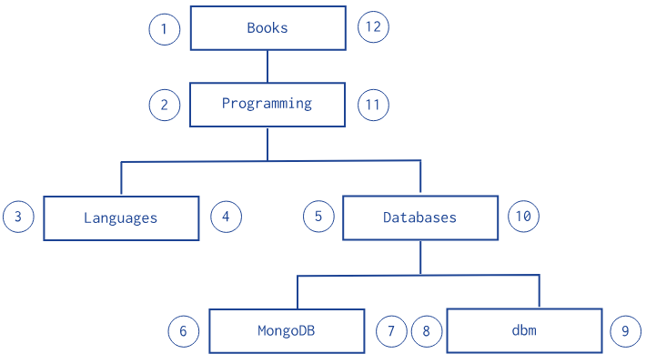

# Model Tree Structures in MongoDB

# Table of Contents
- [Parent References](#parent-references)
- [Child References](#child-references)
- [Array of Ancestors](#array-of-ancestors)
- [Materialized Path](#materialized-path)
- [Nested Sets](#nested-sets)

Below is the list of design patterns that can be used when one tries to model tree-kind of structures in MongoDB. Those design patterns’ summaries are derived from the official MongoDB documentations.

---

# Parent References

As the naming suggests the idea is store the parent tree-node’s reference in child node. 
For example:

```jsx
db.categories.insertMany( [
   { _id: "MongoDB", parent: "Databases" },
   { _id: "dbm", parent: "Databases" },
   { _id: "Databases", parent: "Programming" },
   { _id: "Languages", parent: "Programming" },
   { _id: "Programming", parent: "Books" },
   { _id: "Books", parent: null }
])
```

This design pattern is suitable, in my opinion, in cases when we are interested in closely related tree-nodes (i.e child nodes or parent node). 

---

# Child References

In comparison to the `Parent References`  design pattern, the idea of this one is to store references of all direct children nodes. 
For example:

```jsx
db.categories.insertMany( [
   { _id: "MongoDB", children: [] },
   { _id: "dbm", children: [] },
   { _id: "Databases", children: [ "MongoDB", "dbm" ] },
   { _id: "Languages", children: [] },
   { _id: "Programming", children: [ "Databases", "Languages" ] },
   { _id: "Books", children: [ "Programming" ] }
])
```

This design pattern, in my opinion, is similar to `Parent References`  design pattern but in stead of storing parent node’s reference we store children nodes’ references. 

While the approaches are similar for both `Child` and `Parent` References, there are some cases when one is better than the other. For example, `Parent` References is better choice when the children nodes can be a large number of elements, then better to use `Parent` References to avoid exceeding MongoDB document’s size threshold or when there is a need to support moving a child node from one parent node to another. On the other hand `Child` References is better when we need a simple intuitive implementation and only looking to fetch the children node references.

---

# Array of Ancestors

This design pattern suggests to keep all ancestors (i.e. higher level nodes references) in an array. For example:

```jsx
db.categories.insertMany( [
  { _id: "MongoDB", ancestors: [ "Books", "Programming", "Databases" ], parent: "Databases" },
  { _id: "dbm", ancestors: [ "Books", "Programming", "Databases" ], parent: "Databases" },
  { _id: "Databases", ancestors: [ "Books", "Programming" ], parent: "Programming" },
  { _id: "Languages", ancestors: [ "Books", "Programming" ], parent: "Programming" },
  { _id: "Programming", ancestors: [ "Books" ], parent: "Books" },
  { _id: "Books", ancestors: [ ], parent: null }
])
```

This is a suitable solution if one is interested to easily query the complete path to the node from the root-level node. Still it is possible to query the parent node and child nodes of a given tree node. In my opinion, this is the most straight forward and flexible design pattern. The main disadvantage of this pattern is that in case of very large tree structures one may exceed MongoDB document’s size threshold. 

---

# Materialized Path

The idea behind this design pattern is to keep a string of all ancestors divided by comma. 
For example:

```jsx
db.categories.insertMany( [
   { _id: "Books", path: null },
   { _id: "Programming", path: ",Books," },
   { _id: "Databases", path: ",Books,Programming," },
   { _id: "Languages", path: ",Books,Programming," },
   { _id: "MongoDB", path: ",Books,Programming,Databases," },
   { _id: "dbm", path: ",Books,Programming,Databases," }
])
```

This design pattern basically provides the same functionality as `Array of Ancestors` but most of the queries are forced to use regex. However, documentation it is written that this design pattern is slightly faster then `Array of Ancestors`.

---

# Nested Sets



The idea of this design pattern is to mark each tree node with two values, fist one means the node’s number from root-node to the leaf-node and second one means the node’s number from the leaf-node to the root-node or in other words each node is being marked in the round-trip from root-node to the last leaf-node. 
For example:

```jsx
db.categories.insertMany( [
   { _id: "Books", parent: 0, left: 1, right: 12 },
   { _id: "Programming", parent: "Books", left: 2, right: 11 },
   { _id: "Languages", parent: "Programming", left: 3, right: 4 },
   { _id: "Databases", parent: "Programming", left: 5, right: 10 },
   { _id: "MongoDB", parent: "Databases", left: 6, right: 7 },
   { _id: "dbm", parent: "Databases", left: 8, right: 9 }
] )
```

So we can both get the parent-node and direct child-nodes, as well as using the assigned integers we can easily query all descendants of a node. Thus if `Array of Ancestors`  is suitable to get all ancestors, then this is suitable to get all descendants. The disadvantage of this design pattern that is it inefficient for updating tree. Imagine moving a child-node from one parent to another. Even though still can be solved with adding right value of the new parent to the left value of new parent’s sibling parent and divide by two.
