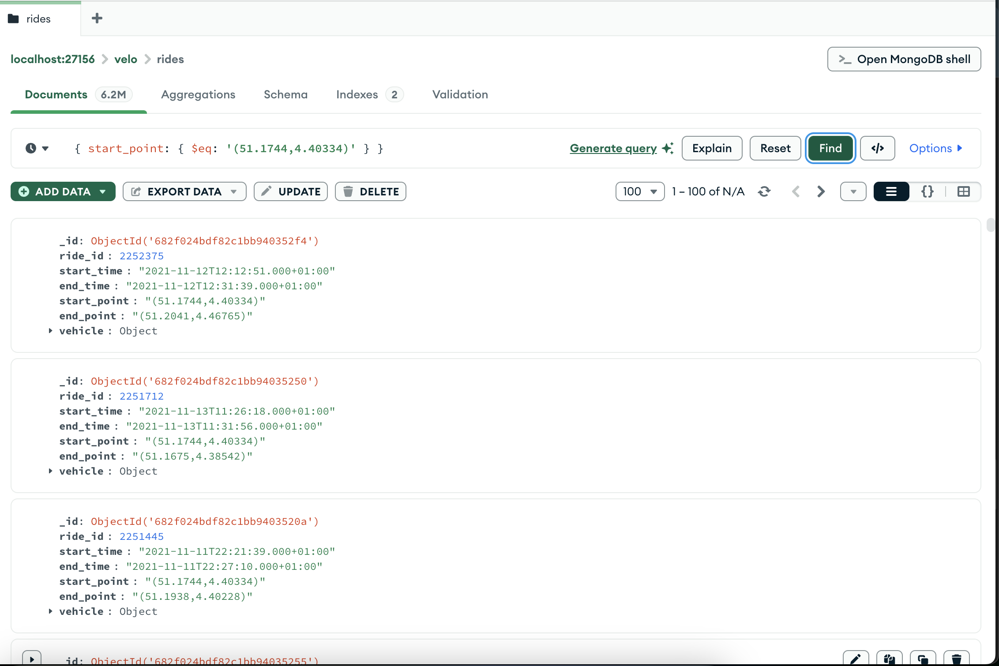

# MongoDB Sharded Cluster

Group 47 - Robert Sargsyan

# Definitions

**Cluster:** A collection of interconnected servers (aka psychical machines)
**Replica Set:** A group of 3 servers which work together to support data redundancy and fault tolerance
**Shard:** A **l**ogical unit that has its own replica set and encapsulates a subset of a data.
**Shard Key:** A single or compound key which is used to split data into chunks.
**Config Server:** A logical unit consisting of a replica set which is responsible to storing metadata about the cluster’s shards as well as for balancing workload of the shards.
**Mongod:** A mongo daemon which handles all upcoming CRUD operations as well as actual data storage.
**Mongos:** A mongo router which handles all upcoming requests from clients and routes to respective shards. 
**Mongosh:** Mongo shell, which is used to interact with mongod and mongos instances.

# Preface

In a real world production environment all `mongod`  instances are running on separate machines not in one machine as shown below. Actually, running `mongod`  instances on separate machines is the idea of horizontal scaling. However, in below example, all mongod instances are running on the same machine but on different ports just to demonstrate the functionality of the MongoDB sharded cluster.

# Objective

As mentioned in the assignment the sharded cluster needs to have **3** shards (each with 2 replica set members), one config server (with a replica set) and one router. Note that usually the shard’s replica set includes 3 members (aka 1 primary and 2 secondary nodes) but in this case we only need one primary and one secondary nodes. 

Both preparing the data and initiating a MongoDB cluster has been done by running scripts. Which you can find below. This gives us an opportunity to replicate the result quickly and to display the order of the commands.

# Preparing JSON data

First of all the json data is prepared. Here is the python script that prepares json data that later is going to be imported into MongoDB.

```python
import os
import json

from pyspark.sql import functions as F
from src.utils import spark_utils as SparkUtils
from src.utils import config_utils as ConfigUtils

ConfigUtils.set_connection_profile('project')
spark = SparkUtils.get_spark_session()
data_path = './data'

def get_latest_db_data():
    vehicles = SparkUtils.get_db_table('vehicles', 'vehicleId', 4, 0, 7000)
    rides = SparkUtils.get_db_table('rides', 'rideid', 20, 0, 4000000)

    return (rides.alias('r').join(vehicles.alias('v'), on='vehicleid')
    .select(
        rides.rideid.alias('ride_id'),
        rides.starttime.alias('start_time'),
        rides.endtime.alias('end_time'),
        rides.startpoint.alias('start_point'),
        rides.endpoint.alias('end_point'),
        F.struct(
            vehicles.vehicleid.alias('vehicle_id'),
            vehicles.serialnumber.alias('serial_number'),
            vehicles.bikelotid.alias('bike_lot_id'),
            vehicles.lastmaintenanceon.alias('last_maintenance_on'),
            vehicles.lockid.alias('lock_id'),
            vehicles.position.alias('position')
        ).alias('vehicle')
    ))

def append_data(data):
    data.coalesce(1).write.format('json').mode('overwrite').save(data_path)

    file_path = next(f for f in os.listdir(data_path) if f.startswith("part-") and f.endswith(".json"))
    with open( os.path.join(data_path, file_path), 'r') as json_file:
        lines = [json.loads(line) for line in json_file]

    with open('data.json', 'w') as formated_json_file:
        json.dump(lines, formated_json_file, indent=2)

rides = get_latest_db_data()
append_data(rides)
```

`get_latest_db_data()`  is responsible for fetching the data, joining the tables and selecting required columns in a way that can be directly converted into json format later.

`append_data(data)`  is responsible for storing the data as a single file in a json format. `json`  package is used here to make sure that the data is saved in a formatted way, which means that all records are put into an array and are split by commas. 

# Initiating MongoDB Sharded Cluster

The sharded cluster is initiated using a single bash script. Here is the bash script responsible to creating a sharded cluster with all required components.

```bash
#!/bin/sh

mkdir "../../mongodb_cluster" && cd "../../mongodb_cluster"

mkdir "logs"

mkdir "config0" "config1" "config2"
mkdir "shard0_0" "shard0_1"
mkdir "shard1_0" "shard1_1"
mkdir "shard2_0" "shard2_1"

mongod --configsvr --dbpath config0 --port 27050 --fork --logpath log.config0 --replSet config
mongod --configsvr --dbpath config1 --port 27051 --fork --logpath log.config1 --replSet config
mongod --configsvr --dbpath config2 --port 27052 --fork --logpath log.config2 --replSet config

mongosh --port 27050 --eval 'rs.initiate({
  _id: "config",
  configsvr: true,
  members: [
    { _id: 0, host: "localhost:27050" },
    { _id: 1, host: "localhost:27051" },
    { _id: 2, host: "localhost:27052" }
  ]
})'

mongod --shardsvr --dbpath shard0_0 --port 27150 --fork --logpath log.shard0_0 --replSet shard0
mongod --shardsvr --dbpath shard0_1 --port 27151 --fork --logpath log.shard0_1 --replSet shard0
mongod --shardsvr --dbpath shard1_0 --port 27152 --fork --logpath log.shard1_0 --replSet shard1
mongod --shardsvr --dbpath shard1_1 --port 27153 --fork --logpath log.shard1_1 --replSet shard1
mongod --shardsvr --dbpath shard2_0 --port 27154 --fork --logpath log.shard2_0 --replSet shard2
mongod --shardsvr --dbpath shard2_1 --port 27155 --fork --logpath log.shard2_1 --replSet shard2

mongosh --port 27150 --eval 'rs.initiate({
  _id: "shard0",
  members: [
    { _id: 0, host: "localhost:27150" },
    { _id: 1, host: "localhost:27151" }
  ]
})'
mongosh --port 27152 --eval 'rs.initiate({
  _id: "shard1",
  members: [
    { _id: 0, host: "localhost:27152" },
    { _id: 1, host: "localhost:27153" }
  ]
})'
mongosh --port 27154 --eval 'rs.initiate({
  _id: "shard2",
  members: [
    { _id: 0, host: "localhost:27154" },
    { _id: 1, host: "localhost:27155" }
  ]
})'

mongos --configdb "config/localhost:27050,localhost:27051,localhost:27052" --port 27156 --fork --logpath log.mongos1
mongosh --port 27156 --eval 'sh.addShard("shard0/localhost:27150")'
mongosh --port 27156 --eval 'sh.addShard("shard1/localhost:27152")'
mongosh --port 27156 --eval 'sh.addShard("shard2/localhost:27154")'

mongosh --port 27156 --eval 'sh.enableSharding("velo")'
mongosh --port 27156 --eval 'sh.shardCollection("velo.rides", {ride_id: 1})'

exit 0
```

1. Creates folders for config server and shards where the data is going to be stored. Each `mongod`  instance has its own folder.
2. Initiates a `mongod` instances for config server’s replica set. `—-logpath` is required here because `--fork` option is used, which is responsible for running the process in background. `--replSet`  is responsible for mapping `mongod` instances as a replica set. `--configsvr`  is responsible for running `mongod`  instance in a config server mode.
3. Once the config server replica set is up and running, we explicitly map replica set `mongod`  instances together, after which in a few seconds a primary node is elected. 
4. Similarly to config server, shards’ replica sets are initiated. The main difference that now 
`--shardsvr`  is used to run `mongod`  instance in shard mode. 
5. Once shards’ replica sets are up and running, the replica sets’ instances are mapped together after which a primary node is elected for each shard.
6. A single mongo router is initiated with mapped config server. Router uses config server to fetch metadata about the cluster in order to map upcoming requests to respective shards.
7. All 3 shards are added to the mongo router. 
8. Sharding is enabled for the `velo`  db. For the `rides`  collection, shard key is set to the `ride_id` .
9. Once the MongoDB cluster is up and running, we connect in MongoDB Compass to the mongo router and import the prepared data.

# Sharded cluster health check and inspection

Once all above mentioned steps are taken, we can check the status for shards and replica sets using `sh.status()` and `rs.status()`  methods. `sh.status()` is run on one of the routers while `rs.status()` is run on primary node of the replica set. Here is the expected result:

`sh.status()` response:

```bash
[direct: mongos] test> sh.status()
shardingVersion
{ _id: 1, clusterId: ObjectId('682f00da6fbc37d25ca49ae1') }
---
shards
[
  {
    _id: 'shard0',
    host: 'shard0/localhost:27150,localhost:27151',
    state: 1,
    topologyTime: Timestamp({ t: 1747910885, i: 12 }),
    replSetConfigVersion: Long('1')
  },
  {
    _id: 'shard1',
    host: 'shard1/localhost:27152,localhost:27153',
    state: 1,
    topologyTime: Timestamp({ t: 1747910887, i: 12 }),
    replSetConfigVersion: Long('1')
  },
  {
    _id: 'shard2',
    host: 'shard2/localhost:27154,localhost:27155',
    state: 1,
    topologyTime: Timestamp({ t: 1747910888, i: 15 }),
    replSetConfigVersion: Long('1')
  }
]
---
active mongoses
[ { '8.0.4': 1 } ]
---
autosplit
{ 'Currently enabled': 'yes' }
---
balancer
{
  'Currently enabled': 'yes',
  'Currently running': 'no',
  'Failed balancer rounds in last 5 attempts': 0,
  'Migration Results for the last 24 hours': { '6': 'Success' }
}
---
shardedDataDistribution
[
  {
    ns: 'velo.rides',
    shards: [
      {
        shardName: 'shard0',
        numOrphanedDocs: 0,
        numOwnedDocuments: 1125787,
        ownedSizeBytes: 401905959,
        orphanedSizeBytes: 0
      },
      {
        shardName: 'shard1',
        numOrphanedDocs: 0,
        numOwnedDocuments: 1123693,
        ownedSizeBytes: 402282094,
        orphanedSizeBytes: 0
      },
      {
        shardName: 'shard2',
        numOrphanedDocs: 0,
        numOwnedDocuments: 1750520,
        ownedSizeBytes: 635438760,
        orphanedSizeBytes: 0
      }
    ]
  },
  {
    ns: 'config.system.sessions',
    shards: [
      {
        shardName: 'shard0',
        numOrphanedDocs: 0,
        numOwnedDocuments: 1,
        ownedSizeBytes: 99,
        orphanedSizeBytes: 0
      }
    ]
  }
]
---
databases
[
  {
    database: { _id: 'config', primary: 'config', partitioned: true },
    collections: {
      'config.system.sessions': {
        shardKey: { _id: 1 },
        unique: false,
        balancing: true,
        chunkMetadata: [ { shard: 'shard0', nChunks: 1 } ],
        chunks: [
          { min: { _id: MinKey() }, max: { _id: MaxKey() }, 'on shard': 'shard0', 'last modified': Timestamp({ t: 1, i: 0 }) }
        ],
        tags: []
      }
    }
  },
  {
    database: {
      _id: 'velo',
      primary: 'shard2',
      version: {
        uuid: UUID('1a4877c0-e817-48d2-8d79-a44398064435'),
        timestamp: Timestamp({ t: 1747910889, i: 2 }),
        lastMod: 1
      }
    },
    collections: {
      'velo.rides': {
        shardKey: { ride_id: 1 },
        unique: false,
        balancing: true,
        chunkMetadata: [
          { shard: 'shard0', nChunks: 3 },
          { shard: 'shard1', nChunks: 3 },
          { shard: 'shard2', nChunks: 1 }
        ],
        chunks: [
          { min: { ride_id: MinKey() }, max: { ride_id: 377016 }, 'on shard': 'shard0', 'last modified': Timestamp({ t: 2, i: 0 }) },
          { min: { ride_id: 377016 }, max: { ride_id: 752975 }, 'on shard': 'shard1', 'last modified': Timestamp({ t: 3, i: 0 }) },
          { min: { ride_id: 752975 }, max: { ride_id: 1127883 }, 'on shard': 'shard0', 'last modified': Timestamp({ t: 4, i: 0 }) },
          { min: { ride_id: 1127883 }, max: { ride_id: 1502791 }, 'on shard': 'shard1', 'last modified': Timestamp({ t: 5, i: 0 }) },
          { min: { ride_id: 1502791 }, max: { ride_id: 1876655 }, 'on shard': 'shard0', 'last modified': Timestamp({ t: 6, i: 0 }) },
          { min: { ride_id: 1876655 }, max: { ride_id: 2249481 }, 'on shard': 'shard1', 'last modified': Timestamp({ t: 7, i: 0 }) },
          { min: { ride_id: 2249481 }, max: { ride_id: MaxKey() }, 'on shard': 'shard2', 'last modified': Timestamp({ t: 7, i: 1 }) }
        ],
        tags: []
      }
    }
  }
]

```

`rs.status()` response:

```bash
shard0 [direct: secondary] test> rs.status()
{
  set: 'shard0',
  date: ISODate('2025-05-22T11:59:18.173Z'),
  myState: 2,
  term: Long('2'),
  syncSourceHost: 'localhost:27151',
  syncSourceId: 1,
  heartbeatIntervalMillis: Long('2000'),
  majorityVoteCount: 2,
  writeMajorityCount: 2,
  votingMembersCount: 2,
  writableVotingMembersCount: 2,
  optimes: {
    lastCommittedOpTime: { ts: Timestamp({ t: 1747915155, i: 1 }), t: Long('2') },
    lastCommittedWallTime: ISODate('2025-05-22T11:59:15.155Z'),
    readConcernMajorityOpTime: { ts: Timestamp({ t: 1747915155, i: 1 }), t: Long('2') },
    appliedOpTime: { ts: Timestamp({ t: 1747915155, i: 1 }), t: Long('2') },
    durableOpTime: { ts: Timestamp({ t: 1747915155, i: 1 }), t: Long('2') },
    writtenOpTime: { ts: Timestamp({ t: 1747915155, i: 1 }), t: Long('2') },
    lastAppliedWallTime: ISODate('2025-05-22T11:59:15.155Z'),
    lastDurableWallTime: ISODate('2025-05-22T11:59:15.155Z'),
    lastWrittenWallTime: ISODate('2025-05-22T11:59:15.155Z')
  },
  lastStableRecoveryTimestamp: Timestamp({ t: 1747915104, i: 6 }),
  electionParticipantMetrics: {
    votedForCandidate: true,
    electionTerm: Long('2'),
    lastVoteDate: ISODate('2025-05-22T11:31:34.494Z'),
    electionCandidateMemberId: 1,
    voteReason: '',
    lastWrittenOpTimeAtElection: { ts: Timestamp({ t: 1747913482, i: 1 }), t: Long('1') },
    maxWrittenOpTimeInSet: { ts: Timestamp({ t: 1747913482, i: 1 }), t: Long('1') },
    lastAppliedOpTimeAtElection: { ts: Timestamp({ t: 1747913482, i: 1 }), t: Long('1') },
    maxAppliedOpTimeInSet: { ts: Timestamp({ t: 1747913482, i: 1 }), t: Long('1') },
    priorityAtElection: 1,
    newTermStartDate: ISODate('2025-05-22T11:31:34.546Z'),
    newTermAppliedDate: ISODate('2025-05-22T11:31:34.577Z')
  },
  members: [
    {
      _id: 0,
      name: 'localhost:27150',
      health: 1,
      state: 2,
      stateStr: 'SECONDARY',
      uptime: 4295,
      optime: { ts: Timestamp({ t: 1747915155, i: 1 }), t: Long('2') },
      optimeDate: ISODate('2025-05-22T11:59:15.000Z'),
      optimeWritten: { ts: Timestamp({ t: 1747915155, i: 1 }), t: Long('2') },
      optimeWrittenDate: ISODate('2025-05-22T11:59:15.000Z'),
      lastAppliedWallTime: ISODate('2025-05-22T11:59:15.155Z'),
      lastDurableWallTime: ISODate('2025-05-22T11:59:15.155Z'),
      lastWrittenWallTime: ISODate('2025-05-22T11:59:15.155Z'),
      syncSourceHost: 'localhost:27151',
      syncSourceId: 1,
      infoMessage: '',
      configVersion: 1,
      configTerm: 2,
      self: true,
      lastHeartbeatMessage: ''
    },
    {
      _id: 1,
      name: 'localhost:27151',
      health: 1,
      state: 1,
      stateStr: 'PRIMARY',
      uptime: 4284,
      optime: { ts: Timestamp({ t: 1747915155, i: 1 }), t: Long('2') },
      optimeDurable: { ts: Timestamp({ t: 1747915155, i: 1 }), t: Long('2') },
      optimeWritten: { ts: Timestamp({ t: 1747915155, i: 1 }), t: Long('2') },
      optimeDate: ISODate('2025-05-22T11:59:15.000Z'),
      optimeDurableDate: ISODate('2025-05-22T11:59:15.000Z'),
      optimeWrittenDate: ISODate('2025-05-22T11:59:15.000Z'),
      lastAppliedWallTime: ISODate('2025-05-22T11:59:15.155Z'),
      lastDurableWallTime: ISODate('2025-05-22T11:59:15.155Z'),
      lastWrittenWallTime: ISODate('2025-05-22T11:59:15.155Z'),
      lastHeartbeat: ISODate('2025-05-22T11:59:16.238Z'),
      lastHeartbeatRecv: ISODate('2025-05-22T11:59:17.876Z'),
      pingMs: Long('0'),
      lastHeartbeatMessage: '',
      syncSourceHost: '',
      syncSourceId: -1,
      infoMessage: '',
      electionTime: Timestamp({ t: 1747913494, i: 1 }),
      electionDate: ISODate('2025-05-22T11:31:34.000Z'),
      configVersion: 1,
      configTerm: 2
    }
  ],
  ok: 1,
  '$clusterTime': {
    clusterTime: Timestamp({ t: 1747915155, i: 1 }),
    signature: {
      hash: Binary.createFromBase64('AAAAAAAAAAAAAAAAAAAAAAAAAAA=', 0),
      keyId: Long('0')
    }
  },
  operationTime: Timestamp({ t: 1747915155, i: 1 })
}

```

Here is an example query response run on the cluster:


