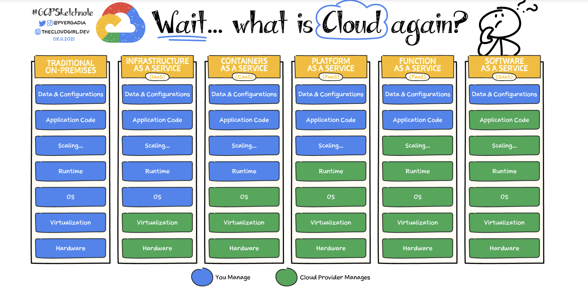

# Cloud-Service Models

The main difference between the models is **the level of abstraction** and in some cases the **pricing** that the models provide. Or in other words, different models provide the developers with the different level of control over their underlying infrastructure.

### IaaS (Infrastructure as a Service):

Provides the broadest control to the developers on the underlying infrastructure. The Cloud-service provider is only responsible for maintaining the actual bare hardware and also allocating requested resources to the developers (virtualization). The operating system, additional tools and frameworks, the maintenance of the OS, deployment and running of the application, and its scalability are all on developer.

### CaaS (Container as a Service)

Provides similar to the IaaS functionality and control with the difference that the hosting operating system, its maintenance is being handled by the Cloud-Service provider. On top of that the Cloud-Service provider also handles the container orchestration for you application. Anything related to the containers’ images (OS, frameworks and tools, configuration) is still handled by the developers besides the actual application runtime and configuration. 

### PaaS (Platform as a Service)

Is a gold middle option in terms of abstraction and control over the application. Cloud-Service provider also handles the used frameworks, and tools while developer is only responsible for handling application related stuff such as deployment, configuration, scalability. In other words if we IaaS and CaaS the developers also need to manage all the tools and technologies used by the application (i.e. databases, message queues, loggers, etc.), in case of PaaS all of this is managed by Cloud-Service provider.

### FaaS (Function as a Service) (aka Serverless)

This is a newly emerging type of cloud-service model, which basically similar to the PaaS with a difference that the scalability, deployment and deployment related configuration are handled by the Cloud-Service provider. Also the pricing model is different because there is no all-time dedicated infrastructure/resources. This is way it is also refers as serverless.

### SaaS (Software as a Service)

This is the most widely used options, where the Cloud-Service provider handles everything besides the customer-specific data. These kind of services are being used by regular people in a daily basis. For example, Gmail, OneDrive, Zoom, etc.

## PaaS vs FaaS

The PaaS and FaaS cloud service models have two main differences. 

- **Abstraction**
    
    In PaaS the Cloud Service Provider is responsible for providing the complete environment for your runtime, which includes the underlying hardware resources, the used operating system and its maintenance, the used frameworks, tools and their maintenance. The developer is responsible for deploying the application, managing the application related configuration on the environment, and managing the scalability.
    
    In FaaS the Cloud Service Provider in addition to all its responsibilities in PaaS model is also responsible for handling the scalability (aka allocation of the additional resource), and runtime of the application (aka booting the app, shutting it down when not used).
    
- **Pricing**
    
    In PaaS, developer pays for a specific amount of allocated resources besides the fact whether it is used or not.
    
    In FaaS, developer pays-on-the-go, which means it pays only for the consumed resources.
