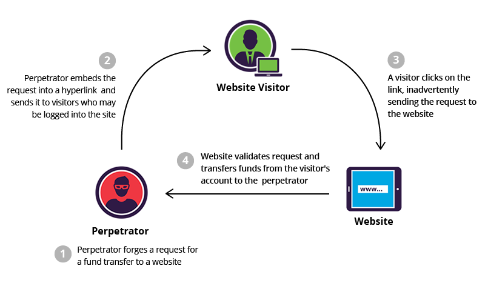
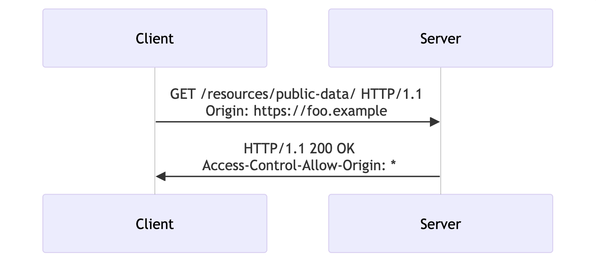
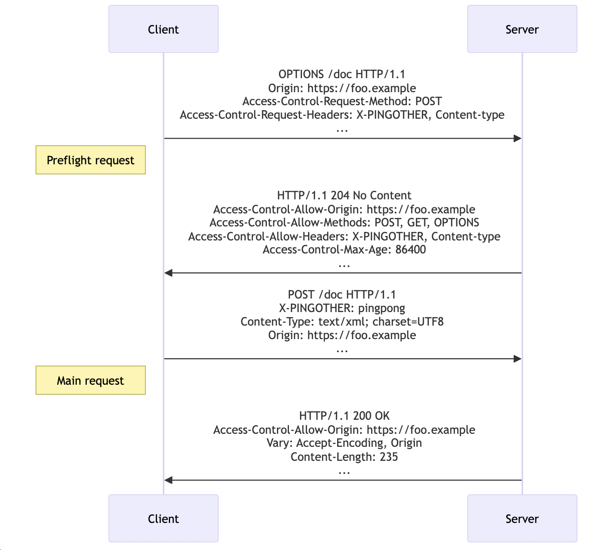

# CORS and CSRF

CORS (Cross-Origin Resource Sharing) and CSRF (Cross-Site Request Forgery) are two vulnerabilities that can be used by attackers to trick users to submit authorized but unintended requests. The following diagram shows an example of how it can happen:
  



The CSRF and CORS policies are meant to prevent attacker from accessing users’ resources or tricking users to processes unintended requests. 

## CORS

The CORS policy is about preventing requests from domains that aren’t specified in `Access-Control-Allow-Origin`  response header. There are three main values that this header can have:

- `*`  ⇒ Means all origins are allowed.
- `<origin>`  ⇒ Specifies the single origin that is allowed, or if multiple origins are allowed returns the origin of the requested domain, in case requested domain is also allowed.
- `null`  ⇒ Means the requested domain origin isn’t allowed.

This CORS is a client-side policy, meaning that the browser checks if the given AJAX request can be satisfied or not. There are two main scenarios for checking if the request is allowed or not.

The requests are divided into two types - complex and simple. There are a number of characteristics that define what is the type of the request. Read more about [simple](https://developer.mozilla.org/en-US/docs/Web/HTTP/Guides/CORS#simple_requests) and [complex](https://developer.mozilla.org/en-US/docs/Web/HTTP/Guides/CORS#preflighted_requests) requests [here](https://developer.mozilla.org/en-US/docs/Web/HTTP/Guides/CORS). 

In case of simple request, the browser makes the actual request, gets the answer back and before display to the user, it checks if `Access-Control-Allow-Origin` response header contains the origin or is a wildcard. If so, then the request is satisfied, otherwise a CORS error is thrown.



In case of complex request, an initial preflight request is sent with the method `OPTIONS`  to check if the domain is allowed to send the actual request. This is done because the complex request can change the state in the server even though the origin isn’t allowed.



As mentioned earlier the CORS policy only checks the AJAX requests, thus the embedded html requests that can be found in <link>, <script>, <src>, , etc. are not being checked. This happens due to the embedded nature of the HTML. Nowadays it is almost impossible to imagine even static websites that don’t use any third-party scripts, styling, images or other assets (BootStrap, JQuery, Freepik, Fontawsome, Google Fonts, Youtube). That’s why the embedded requests are meant to be done to servers that don’t share the same domain or don’t server the website’s domain. Otherwise we would have to host all the required resources, which is not great, especially when we can make use of CDN. 

For example, this request will be satisfied due to its embedded nature:

```jsx
// index.html

<script>
    (async () => {
        const quote = await fetch('https://thequoteshub.com/api/random-quote').then(response => response.json())
        document.getElementById('dayQuote').innerText = quote.text
        document.getElementById('dayQuoteAuthor').innerText = quote.author
    })()
</script>
```

But this one will throw a CORS error

```jsx
// main.js

async function fetchQuote(){
	return fetch('https://thequoteshub.com/api/random-quote').then(response => response.json()))
}

document.addEventListener('DOMContentLoaded', async () => {
    const quote = await fetchQuote()
    console.log(quote)
})

```

## CSRF

The CSRF is designed to solve the problem of embedded html requests. Imagine attacker tricks user to open a website where there is a malicious code embedded into HTML file. The code will be executed without any problem, and unintended but authenticated request will be sent to server. 

The CSRF policy is a server-side prevention mechanism that doesn’t attackers to send malicious request even if the request is authenticated. (Note: If the website uses cookies to store authentication tokens, then the browser will implicitly include the token whenever a request is sent.)

This is being done by “injecting” an additional CSRF token into all pages that are returned by the server. Thus whenever a new request is sent to the server, not only the authentication token should be valid but also the CSRF token. The attacker doesn’t have a way to access CSRF token from the other webpage, therefore only with authentication token the requests will be rejected. 

As CSRF attackers can execute the request but can see the results, the CSRF policy spreads on requests that update the state (e.g POST, PATCH, PUT, etc.)

## Conclusion

Both CORS and CSRF policies are very important and used together to prevent unintended requests from being processed. The CORS handles client-side verification for AJAX requests, while the CSRF handles server-side verification for all non-GET requests.
