# Docker

---

# History and Motivation

The idea behind the docker is to have an abstract from hardware and specific operating system environment. This is important in several steps of software creation, especially on development and deployment phases. 

It aims to reduce “It works on my machine.” conflicts. Thus when using docker we can have an environment for software development which is very close to the one in production. It helps to simplify the software deployment process. Deploying an application involves several steps: creating a server, configuring dependencies, copying application code, defining listeners and cron-jobs. Docker takes cares of all these steps, we just need to specify the tasks and order of their execution once. 

The docker provides us with an abstract layer between specific OS and application development/deployment environment. This ensures that everyone is on the same page and use the same configuration, dependencies and resources.

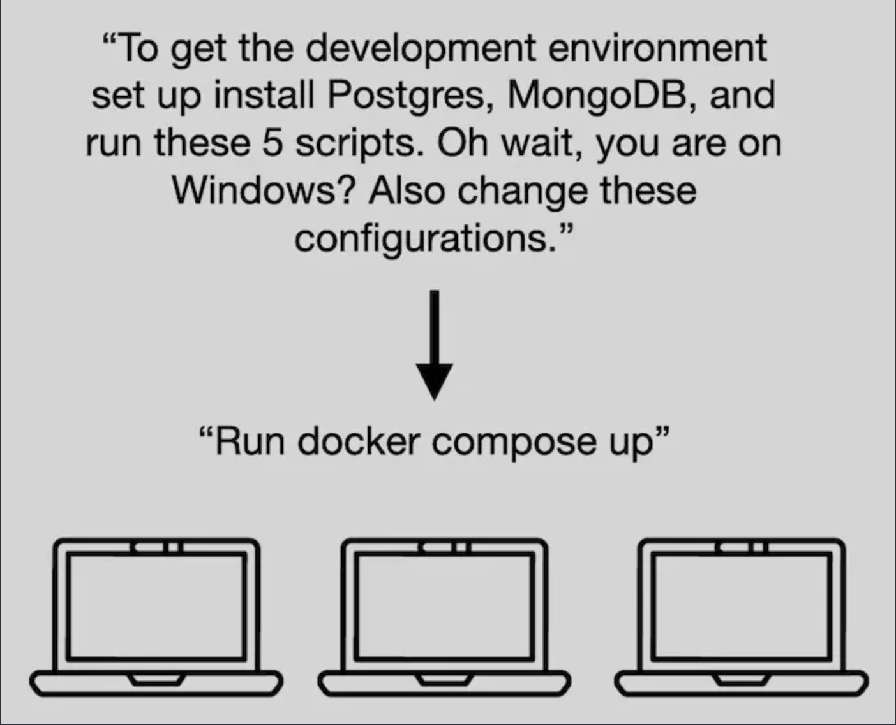

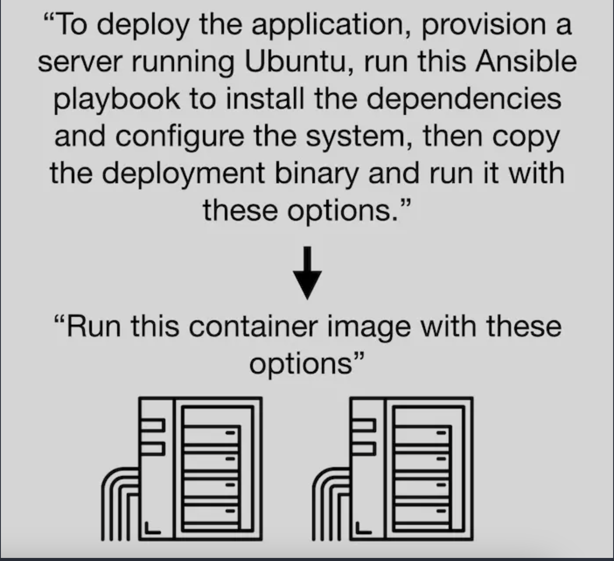

Without Docker:

- You might run into dependencies version mismatches.
- You might hit different behavior between dev and prod due to OS or library changes.
- You might have to install and maintain OS dependencies manually on each environment.

With Docker:

- Everything is containerized.
- The runtime, dependencies, tools, and even the OS base are packaged together.
- The app runs the same on your machine, your teammate’s laptop, your test server, or your cloud host.

# Technology Overview

The concept of containerization make use of three important Linux features:

- **cGroups**: “Control groups” is a linux kernel feature which is responsible for managing CPU usage, system memory, disk I/O operations and network bandwidth for collection of processes. One can create a control group with predefined configuration and then include resource-heavy process to that group. From that point, process will have limited available system resources. Developer can not only allocate system resources bit also monitor and prioritize the control groups.
- **Namespaces**: “Namespaces” is a linux kernel feature which provides process(es) with their abstract environment. The abstraction level depends on the namespace type but the idea is that processes get their isolated view on the system resources.
- **Union File System**: UnionFS is a Linux filesystem service that allows multiple directories (filesystems) to be merged into a single unified view. This is achieved by stacking them as layers—typically with one writable layer (called the upper layer) and one or more read-only layers (lower layers). If the same file exists on the multiple layers, the uppermost layer’s file is being used.
    
    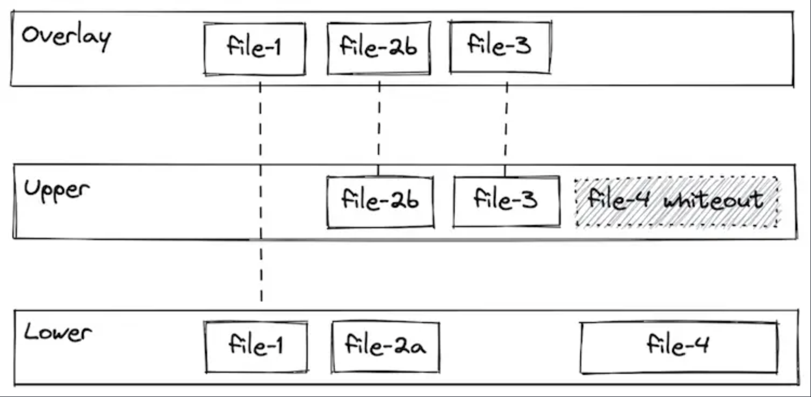
    

# Docker System Components

The Docker System two main components are `Docker Desktop`  and Image `Registry`  (e.g DockerHub). Docker image registry is used to maintain and share images as well as to pull open-source images.

The Docker desktop as you can see from the below diagram consists of the following sub-components:

- A client application:
    - **Command Line Interface (CLI)**: Is used to make call to Docker RestAPIs
    - **Graphical User Interface (GUI)**: Has CLI functionality plus a couple of added functionality for managing Kubernetes.
    - **Credential Helper**: Stores credentials for private registries.
    - **Extensions**: Third-party software that provides added functionality.
- A Linux virtual machine containing:
    - **Docker daemon (`dockerd`)**: A background running service (written on Go) that handles docker API requests. It is responsible for all docker’s functionality.
    - **Docker API**: A collection of REST APIs that is being exposed by `dockerd`  in order to interact with docker.

<aside>
📌

The Linux VM is only present for `macOS` and `Windows` . The VM is required in order to provide Linux features such as `cgroups`, `namespaces` or `unionFS` . For Linux operating system the `dockerd` is being installed directly on host machine.  Besides above mentioned components, `containerd` and `runc` tools are used to run the container and manage it.

</aside>

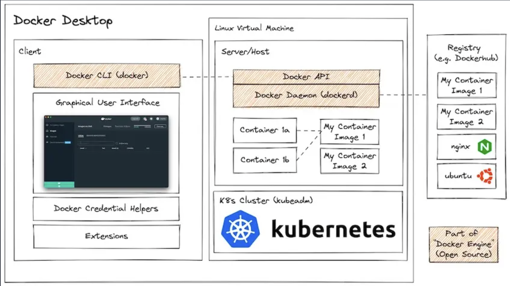

<aside>
📌

“Docker Engine” and “Docker Desktop” terms are sometimes being misused. Docker Engine is a subset of  Docker Desktop components which includes Docker CLI, APIs and daemon and is completely free and open source and can be installed only on Linux.

</aside>

# Container Data Persistence

A container is created from an image. An image is a single merged view of multiple filesystems, where all the layers (filesystems) are read-only except the uppermost layer. Whenever we delete a container any changes made to the uppermost layer are also being discarded. 

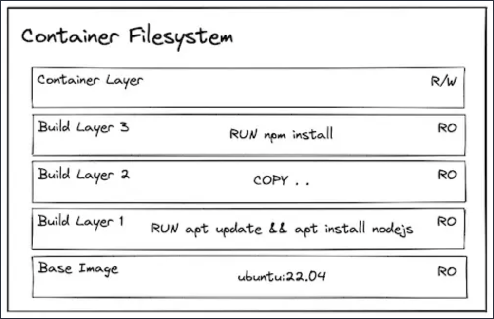

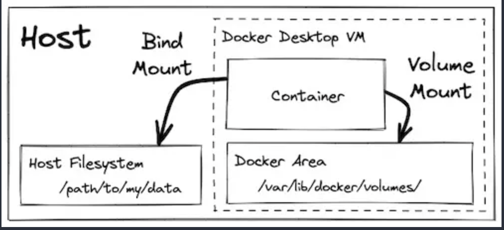

If we want the data to be persisted when a container is deleted then we need to define either docker volumes or bind mount. It’s also useful in case we want to have a single data entity to which multiple separate containers can have an access. 

Volumes and mounts allow us to specify a location outside of the container where we want to persist data. When initiating a container we can attach the container to either volume or mount to persist data there. The Docker volume is a directory handled by docker, while the bind mount is attached to the directory in the host filesystem, thus being handled by developer. 

The Docker volumes are stored in `/var/lib/docker/volumes` . Note that in non-Linux operating systems this path is for VM’s filesystem. In order to access the VM’s docker volumes, we need to run a container on a privileged mode and the host process id’s namespace should be visible. 

```bash
docker run -it --rm --privileged --pid=host justincormack/nsenter1@sha256:5af0be5e42ebd55eea2c593e4622f810065c3f45bb805eaacf43f08f3d06ffd8
```

<aside>
📌

`-it`  options are used to keep the docker interactive and to format the `STDOUT`.  `-i`  is for keeping the `STDIN`  open for a commands and `-t`  is for terminal interface with formatting, colors, etc.

</aside>

# Dockerfile

Dockerfile is a set of instructions which creates a docker image. Each instruction in Dockerfile creates a new layer in a container united filesystem. The Dockerfile is aware of its build context, thus it is possible to use relative paths to references resources from the directory where Dockerfile is placed while building a docker image. However it is important to note that the docker container always runs on the isolated environment.  

`.dockerignore`  is a file which can be placed in the same directory with Dockerfile and prevents a set of resources from being copied into the image during the image build process. 

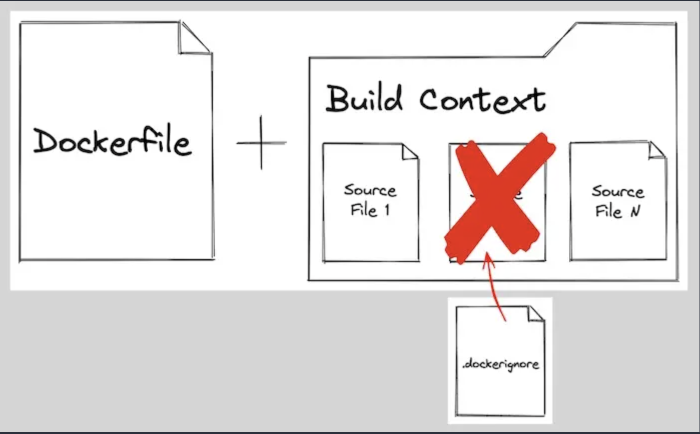

## Docker Instructions

Here is the list of docker instructions that can be used within the Dockerfile. It is important to use the instructions wisely as their order and number can massively impact the eventual size of the image, security and build time.

| [`ADD`](https://docs.docker.com/reference/dockerfile/#add) | Add local or remote files and directories. Like `COPY`  but can work with tars and URLs. |
| --- | --- |
| [`ARG`](https://docs.docker.com/reference/dockerfile/#arg) | Use build-time variables. |
| [`CMD`](https://docs.docker.com/reference/dockerfile/#cmd) | Specify default commands to run when container is created. |
| [`COPY`](https://docs.docker.com/reference/dockerfile/#copy) | Copy files and directories. |
| [`ENTRYPOINT`](https://docs.docker.com/reference/dockerfile/#entrypoint) | Specify default executable. |
| [`ENV`](https://docs.docker.com/reference/dockerfile/#env) | Set environment variables. |
| [`EXPOSE`](https://docs.docker.com/reference/dockerfile/#expose) | Describe which ports your application is listening on. |
| [`FROM`](https://docs.docker.com/reference/dockerfile/#from) | Create a new build stage from a base image. |
| [`HEALTHCHECK`](https://docs.docker.com/reference/dockerfile/#healthcheck) | Check a container's health on startup. |
| [`LABEL`](https://docs.docker.com/reference/dockerfile/#label) | Add metadata to an image. |
| [`ONBUILD`](https://docs.docker.com/reference/dockerfile/#onbuild) | Specify instructions for when the image is used in a build. |
| [`RUN`](https://docs.docker.com/reference/dockerfile/#run) | Execute build commands. |
| [`SHELL`](https://docs.docker.com/reference/dockerfile/#shell) | Set the default shell of an image. |
| [`STOPSIGNAL`](https://docs.docker.com/reference/dockerfile/#stopsignal) | Specify the system call signal for exiting a container. |
| [`USER`](https://docs.docker.com/reference/dockerfile/#user) | Set user and group ID. |
| [`VOLUME`](https://docs.docker.com/reference/dockerfile/#volume) | Create volume mounts. |
| [`WORKDIR`](https://docs.docker.com/reference/dockerfile/#workdir) | Change working directory. |

## Configuring Proper Dockerfile

As mentioned earlier the proper Dockerfile configuration can significantly enhance the image’s security, build-time and size. Below is an example of the properly configured Dockerfile and its explanation. 

```docker
# Name the first stage "base" to reference later
FROM node:19.6-bullseye-slim AS base
LABEL org.opencontainers.image.authors="sid@devopsdirective.com"
WORKDIR /usr/src/app
COPY package*.json ./

# Use the base stage to create dev image
FROM base AS dev
RUN --mount=type=cache,target=/usr/src/app/.npm \
  npm set cache /usr/src/app/.npm && \
  npm install
COPY . .
CMD ["npm", "run", "dev"]

# Use the base stage to create separate production image
FROM base AS production
ENV NODE_ENV production
RUN --mount=type=cache,target=/usr/src/app/.npm \
  npm set cache /usr/src/app/.npm && \
  npm ci --only=production
USER node
COPY --chown=node:node ./src/ .
EXPOSE 3000
CMD [ "node", "index.js" ]
```

### Base Image

If no tag is provided for the base image, then Docker will try to download/use an image with `latest`  tag (which may not always be there). This is not a good practice as the `latest`  image is constantly changing which may introduce a breaking change overtime. It is suggested to use a base image with a specific version tag or in case we want to make sure that we always use the exact same image we can specify the hash code of the version tag as even the version tag can be overwritten.

### Working Directory

When a working directory is not set, the default one it the `root` . This isn’t considered good for the readability and separation of concerns that’s why always set the working directory. 

### Copy Rarely Changing Files First

Docker supports caching of the built image layers for the further builds. This means if you build the exact same image twice, second time will be much faster because the built image layers were cached. In case you change something that effects a layer, from that layer all the subsequent layers will be rebuild. It is suggested to first copy rarely changing files in case you need to do some actions on that files before copying the whole source code (e.g package*.json) because it will support enhanced caching.

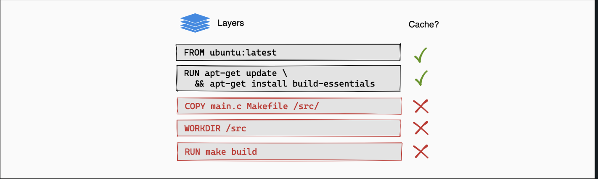

### Use a Non-Root User

For the security reasons it is suggested to create a non-root user which will own the working directory. This is important to limit the privileges of the user while running the container. If not set the image containers will be run with `root` user, which creates an open window for hackers, who already accessed the application, to access or attack to container as well, or even try to access the host system as containers aren’t bulletproof. 

It is important to add a user before setting the user as a primary one, because Docker accesses `/etc/passwd`  for user details. It is also important to remember that instructions like `COPY` , `RUN`, `ADD`  are still being executed as a `root`  user, thus options like `—chown` and `—chmod`  should be considered to give access to the user. 

### Configure NODE_ENV and Use NPM CI

Some `npm`  packages behave differently when `NODE_ENV` variable is `production`. 

The `npm ci`  is used as a better alternative for `npm i` . The `npm ci`  in comparison with `npm i`  requires `package-lock.json`  file to be present and only uses `package-lock.json`  file to install dependencies, even though it checks the `package-lock.json` file matches with `package.json` . The `node_modules` directory is being deleted and recreated. This command in comparison with `npm i`  executes much faster because the `npm ci` stage skips some procedures run by `npm i` (e.g skip version resolution, I/O operations and merging dependencies in `node_modules` )

### Add Useful Metadata

Use `LABEL`  instruction to add useful metadata to the image. This instruction doesn’t add any additional layer to the final image. `EXPOSE`  is also considered more as documentation rather then something that changes image’s behavior as you need to set the port while running the container anyway.

### Docker BuildKit Cache Mount

This specific `RUN` instruction is supported by the Docker’s `BuildKit` tool. The `BuildKit`  internally creates a Docker volume which is being used when an image is being rebuild multiple times. This is especially useful for CI/CD pipelines and image development. This step decreases the build time. The volume is only accessible during the image build and doesn’t violate Docker image’s portability principle as it is completely handled by Docker’s BuildKit internally. The below example uses this feature to support caching during `npm ci` .

```docker
RUN --mount=type=cache,target=/usr/src/app/.npm \
  npm set cache /usr/src/app/.npm && \
  npm ci --only=production
```

## Multi-Stage Dockerfile

The multi-stage image build is an important feature which can be used to decrease the size of the built image as well as can be used to build two independent images with the same custom base (as shown in the above example). It is important to remember that the build always results in one image, all the intermediate stages’ images are temporary. 

As mentioned earlier multi-stage build can be used to create two different images from the same Dockerfile. For example, create an image where the application is set up and initialized either for `development`  or `production`. It can also be used to create a clean image with only minimal binary files required to run the application which results in much smaller image size. An example configuration is listed below.

```docker
FROM node:19.4-bullseye AS build
WORKDIR /usr/src/app
COPY package*.json ./
RUN --mount=type=cache,target=/usr/src/app/.npm \
  npm set cache /usr/src/app/.npm && \
  npm install
COPY . .
RUN npm run build

FROM nginxinc/nginx-unprivileged:1.23-alpine-perl
COPY --link nginx.conf /etc/nginx/conf.d/default.conf
COPY --link --from=build usr/src/app/dist/ /usr/share/nginx/html
EXPOSE 8080
```

## COPY —link

The `COPY —link`  is a Dockerfile instruction which significantly changes how the files are being copied into the image. In some cases this `—link`  option can be very useful (e.g multi-stage build). This instruction creates a standalone copy of the dir which is independent from any base image or previous layers, thus can be used as a component layer in multiple places. 

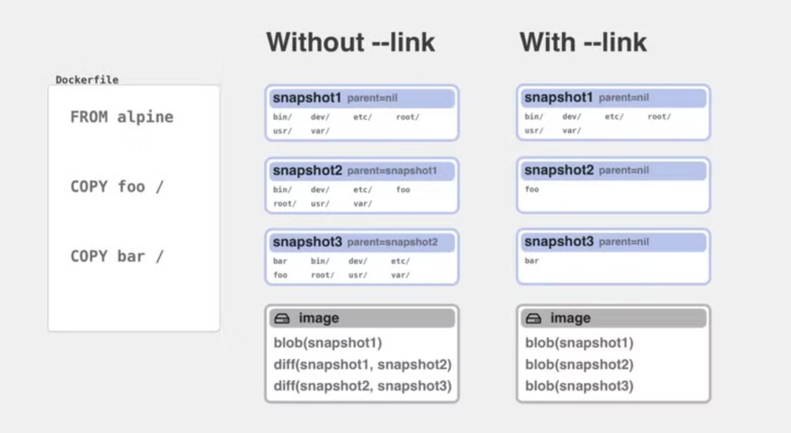

<aside>
🔗

Additional tips for writing proper Dockerfile can be found [here](https://courses.devopsdirective.com/docker-beginner-to-pro/lessons/06-building-container-images/05-general-dockerfile-tips).

</aside>

# Containers

## Registry

The container registry is a local or remote registry where you can store you container **images**. This is like a `github` of container images, actually, one of the remote registry providers is `github`  but usually `DockerHub`  is used for storing container images. Each image has its own repository where different version of the image are stored. Below is the quick guide on how to publish local image to remote repository. 

`GitHub` 

```bash
echo "TOKEN" | docker login ghcr.io -u USERNAME --password-stdin
docker tag my_scratch_image:latest ghcr.io/myusername/my_scratch_image:latest
docker push ghcr.io/myusername/my_scratch_image:latest
```

`DockerHub` 

```bash
docker login
docker tag my_scratch_image:latest myusername/my_scratch_image:latest
docker push myusername/my_scratch_image:latest
```

## Running Options

There are two main options for running a container - either using docker-compose file or regular shell script. The latter is not recommended if you are defining volumes, networks and running multiple containers together. For these purposes `docker-compose`  file exists. 

The docker `network`  is a configuration on how should docker be exposed and how users can be routed to that docker’s ports. There are three main types of docker network: 

- **bridge**: This is a default one, which enables the container to interact with other local containers. In order to interact with external world, container’s port should be bind with the host system’s port using `-p` option.
- **host**: This type of network isn’t recommended as with this configuration the container doesn’t have its isolated IP address but uses the host system IP address.
- **none**: Disables any type of interaction with container.

While running the container, there are some important `run`  options that should be considered:

```bash
# Runs the container in the background.
docker run -d ubuntu sleep 5

# Override the entry point defined in the Dockerfile.
docker run --entrypoint echo ubuntu hello 

# Set environment variables at runtime
docker run --env MY_ENV=hello ubuntu printenv 

# Run Docker's initialization script and spawn the process as a subprocess.
docker run --init ubuntu ps 

# Have an interactive TTY session inside the container.
docker run -it ubuntu 

# Persist data outside of the container layer in a volume.
docker run -e POSTGRES_PASSWORD=foobarbaz -v pgdata:/var/lib/postgresql/data postgres:15.1-alpine

# Provide a specific name for a container.
docker run --name my_container ubuntu sleep 5 

# Connect to a specific Docker network.
docker run --network my_network ubuntu 

# Specify the architecture to run the container image.
docker run --platform linux/arm64/v8 ubuntu dpkg --print-architecture 

# Connect a port from the host system to that of the container.
docker run -p 3000:3000 api-node 

# Restart the container based on the specified policy (always, unless-stopped, or never).
docker run --restart unless-stopped ubuntu 

# Remove the container when the process exits.
docker run --rm --name this_one_will_be_gone ubuntu 
```

## Docker Compose

`docker-compose.yaml`  is used to manage the containers’ run process more efficiently. It internally converts the file into a set of `docker run`  commands and extensively uses the 
`docker run` options. 

The compose file is being build, run and stop using following commands:

```yaml
# Build container images
docker compose build

# Runs containers
docker compose up

# Runs containers in background
docker compose up -d

# Stops containers
docker compose stop
```

Below is an example of a `docker-compose.yaml`  file:

```yaml
services:
  client-react-vite:
    image: client-react-vite
    build:
      context: ../05-example-web-application/client-react/
      dockerfile: ../../06-building-container-images/client-react/Dockerfile.3
    init: true
    volumes:
      - ./client-react/vite.config.js:/usr/src/app/vite.config.js
    networks:
      - frontend
    ports:
      - 5173:5173
  client-react-nginx:
    labels:
      shipyard.primary-route: true
      shipyard.route: '/'
    image: client-react-nginx
    build:
      context: ../05-example-web-application/client-react/
      dockerfile: ../../06-building-container-images/client-react/Dockerfile.5
    init: true
    networks:
      - frontend
    ports:
      - 80:8080
    restart: unless-stopped
  api-node:
    labels:
      shipyard.route: '/api/node/'
      shipyard.route.rewrite: true
    image: api-node
    build:
      context: ../05-example-web-application/api-node/
      dockerfile: ../../06-building-container-images/api-node/Dockerfile.7
    init: true
    depends_on:
      - db
    environment:
      - DATABASE_URL=postgres://postgres:foobarbaz@db:5432/postgres
    networks:
      - frontend
      - backend
    ports:
      - 3000:3000
    restart: unless-stopped
  api-golang:
    labels:
      shipyard.route: '/api/golang/'
      shipyard.route.rewrite: true
    image: api-golang
    build:
      context: ../05-example-web-application/api-golang/
      dockerfile: ../../06-building-container-images/api-golang/Dockerfile.6
    init: true
    depends_on:
      - db
    environment:
      - DATABASE_URL=postgres://postgres:foobarbaz@db:5432/postgres
    networks:
      - frontend
      - backend
    ports:
      - 8080:8080
    restart: unless-stopped
  db:
    image: postgres:15.1-alpine
    volumes:
      - pgdata:/var/lib/postgresql/data
    environment:
      - POSTGRES_PASSWORD=foobarbaz
    networks:
      - backend
    ports:
      - 5432:5432
volumes:
  pgdata:
networks:
  frontend:
  backend:
```

## Container Security

There are two main spheres that you need to pay attention in order to eventually have a secure container.

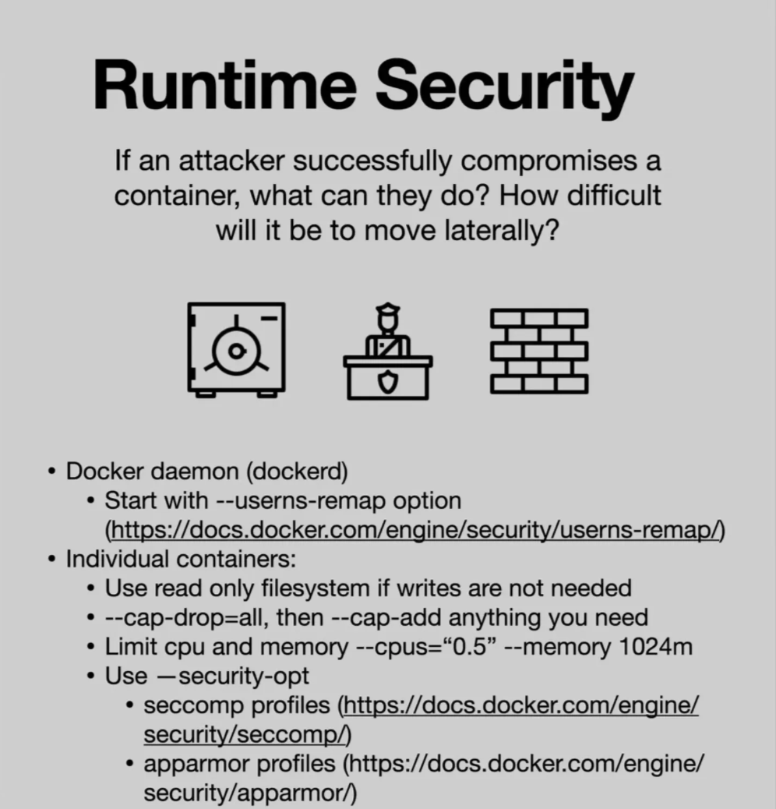

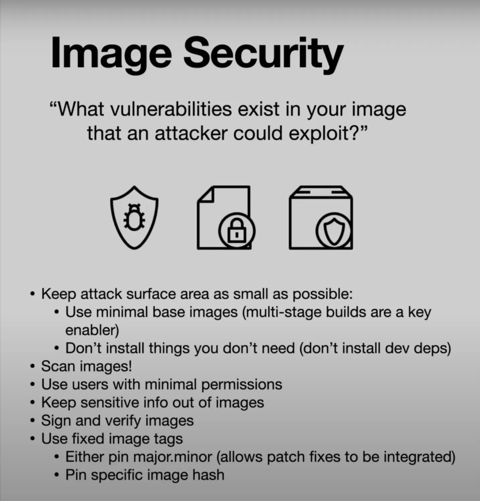
