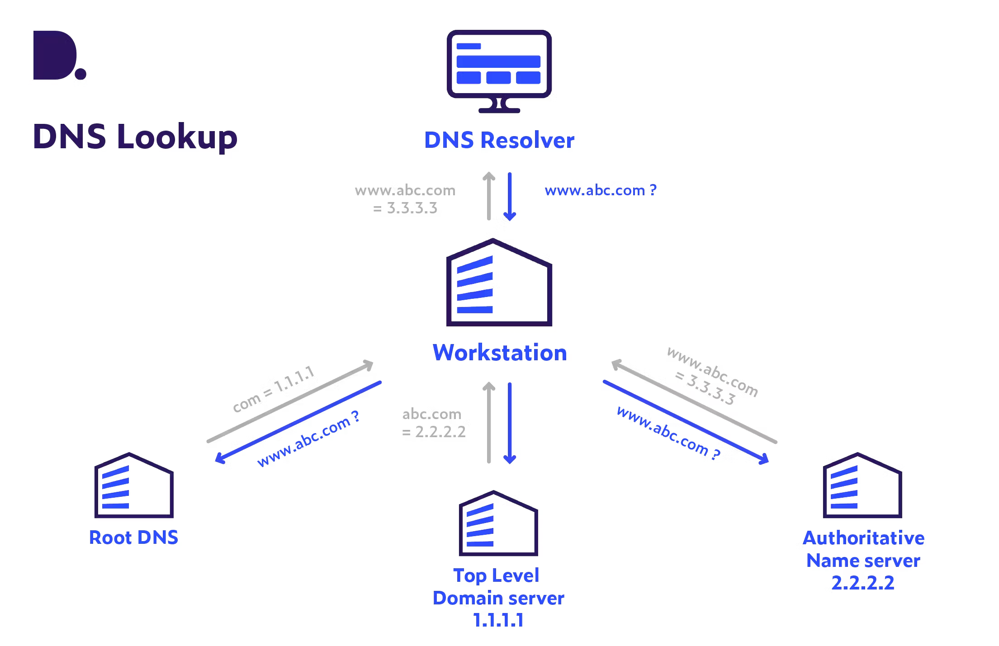

# Managing Domain Registration

There are a number of domain registrars from whom developers can rent domains in a yearly basis. The same domain names can be provided by different registrars so before buying a specific domain, check multiple registrars to find the ultimate price for the domain. For example, [instudy.am](http://instudy.am) costed 40 euros in [godaddy.com](http://godaddy.com) while I bought it for 21 euros from [name.am](http://name.am) .

In order to understand how the domain names are used we need to understand two important concepts - what is a dns record and how does domain lookup works. 

### DNS Record

The domain name system record is a piece of information about the domain which is usually stored in a key-value pairs and has a defined TTL on it. There are different types of DNS records, but the most basic ones are `A` record which is used to map the IPv4 address to the domain name, `AAA` record which is used to map IPv6 address to the domain name, `CNAME`  which is used to set an alias to the domain name and `MX`  record responsible for pointing which mail servers are responsible for mail exchange for this domain (i.e `yourname@example.com`). So, in short, DNS record, depending on its type, stores information about the domain. 

### Domain Lookup

Before buying your first domain, you need to understand how domain lookup works. For example, let’s look at  `menu.am`  domain. When you type `menu.am`  on your browser a number of things happened internally. First of all the browser check the machine’s cache for the domain, in case it finds the related `A` record, the browser will directly request a data from the server. In case that the domain’s `A` record isn’t found in the cache the browser checks with ISP’s cache. If it isn’t found as well, ISP makes another internal call to lookup the domain through, for example, Google’s recursive DNS server. The Google’s server makes a call to root-servers asking them “which servers are responsible for resolving `.am`  top-level domain”, then once it got the related IP address, it makes another call asking which servers (aka **name-servers**) are responsible for storing DNS records for `menu.am`  which points to the server which developer configured to serve DNS records for `menu.am` , then finally the Google’s recursive DNS resolver makes one call to the name-server to get the `A` record that servers `menu.am` , once it gets the IP address it returns it to the browser, which finally gets the data from that IP address. 

It is important to understand that there are different type of top-level domains (aka TLDs). The country code top-level domains (aka cc-TLDs) require additional step of domain owner verification before the domain will be publicly available. Each country handles domain owner-verification for their cc-TLD. For example, `.am`  is handled by government of the Armenia. There are also global TLDs like `.com`  which doesn’t require additional verification. 

### How to buy a domain ?

As stated earlier there a various domain registrars from whom you can buy a domain. Once you bought a domain, you need to complete the verification step in case you domain contains cc-TLD. Remember that the owner verification is being done by the country’s authoritative department from whom you usually get an email after the purchase. 

Once the verification step is done, there are usually two main scenarios. Either the website is being handled directly by the domain name registrar, for example GoDaddy, or you have a different cloud hosting provider. In first case, you can directly connect the website to the domain through the portal of the domain registrar, in second case you need to change the name-servers of the domain to point to the cloud hosting provider. For example, if you bought a domain from GoDaddy and what to use Cloudflare to host your website, then you need to set Cloudflare’s name-servers in GoDaddy, so that during the domain lookup, TLD server will point to the IP address of the Cloudflare’s name-servers for your domain lookup. Thus, the Cloudflare is the one who defines and manages the DNS Records for the domain.
